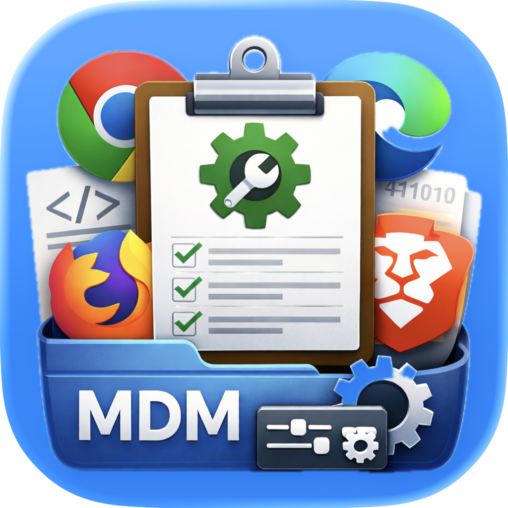

# BrowserConfigEditor

  

  <strong>A macOS application for creating and editing browser policy configurations</strong>

  <a href="https://github.com/gilburns/BrowserConfigEditor/wiki">📚 Documentation</a> •
  <a href="https://github.com/gilburns/BrowserConfigEditor/wiki/Quick-Start-Guide">🚀 Quick Start</a> •
  <a href="https://github.com/gilburns/BrowserConfigEditor/releases">⬇️ Download</a> •
  <a href="https://github.com/gilburns/BrowserConfigEditor/issues">🐛 Report Issue</a>

---

## Overview

BrowserConfigEditor provides a graphical interface for configuring browser policies on macOS. Instead of manually editing XML plist files, use a visual editor to browse available policies, configure settings, and export ready-to-deploy configuration files for your MDM or deployment tool.

Perfect for IT administrators managing enterprise browser deployments.

## Key Features

- **Visual Policy Configuration** - Browse and configure policies through an intuitive GUI
- **Multi-Browser Support** - Chrome, Edge, Safari, Firefox, Brave, and other Chromium browsers
- **Multiple Export Formats** - Property List, JSON, Intune XML, and executable Shell Scripts
- **Import Existing Configs** - Load and edit previously created configurations
- **Search & Filter** - Quickly find policies by name, title, or description
- **Built-in Documentation** - Direct links to vendor policy documentation

## Supported Browsers

- Google Chrome
- Microsoft Edge
- Apple Safari
- Mozilla Firefox
- Brave Browser
- Opera, Vivaldi, and other Chromium-based browsers

See the [Supported Browsers](https://github.com/gilburns/BrowserConfigEditor/wiki/Supported-Browsers) page for the complete list.

## Quick Start

1. **Download** the latest release
2. **Open** the application
3. **Select a browser** from the toolbar
4. **Search and add policies** you want to configure
5. **Export** to your preferred format (plist, JSON, Intune XML, or shell script)
6. **Deploy** via your MDM or using the exported script

📖 **[Full Quick Start Guide](https://github.com/gilburns/BrowserConfigEditor/wiki/Quick-Start-Guide)**

## Export Formats

| Format | Use Case |
|--------|----------|
| **Property List (.plist)** | MDM deployment (Jamf Pro, Mosyle, Kandji, etc.) |
| **JSON (.json)** | Cross-platform, APIs, version control |
| **Intune XML (.xml)** | Microsoft Intune Preference File templates |
| **Shell Script (.sh)** | Direct deployment via script execution |

## Deployment Options

- **[MDM Deployment](https://github.com/gilburns/BrowserConfigEditor/wiki/MDM-Deployment)** - Step-by-step guides for Jamf Pro, Intune, Mosyle, Kandji, and other platforms
- **[Shell Script Deployment](https://github.com/gilburns/BrowserConfigEditor/wiki/Shell-Script-Deployment)** - Quick deployment without MDM

## System Requirements

- **macOS**: 15.5 or later
- **Architecture**: Apple Silicon or Intel

## Documentation

Complete documentation is available in the [Wiki](https://github.com/gilburns/BrowserConfigEditor/wiki):

### Getting Started
- [Quick Start Guide](https://github.com/gilburns/BrowserConfigEditor/wiki/Quick-Start-Guide) - Configure your first policy in 5 minutes
- [Understanding Browser Policies](https://github.com/gilburns/BrowserConfigEditor/wiki/Understanding-Browser-Policies) - Learn about browser policy management

### Core Usage
- [Loading Browser Manifests](https://github.com/gilburns/BrowserConfigEditor/wiki/Loading-Browser-Manifests)
- [Configuring Policies](https://github.com/gilburns/BrowserConfigEditor/wiki/Configuring-Policies)
- [Export Formats](https://github.com/gilburns/BrowserConfigEditor/wiki/Export-Formats)
- [Importing Configurations](https://github.com/gilburns/BrowserConfigEditor/wiki/Importing-Configurations)

### Deployment
- [MDM Deployment Guide](https://github.com/gilburns/BrowserConfigEditor/wiki/MDM-Deployment) - Jamf, Intune, Mosyle, Kandji, and more
- [Shell Script Deployment](https://github.com/gilburns/BrowserConfigEditor/wiki/Shell-Script-Deployment)

### Reference
- [Policy Types Reference](https://github.com/gilburns/BrowserConfigEditor/wiki/Policy-Types-Reference)
- [Supported Browsers](https://github.com/gilburns/BrowserConfigEditor/wiki/Supported-Browsers)
- [Troubleshooting](https://github.com/gilburns/BrowserConfigEditor/wiki/Troubleshooting)
- [FAQ](https://github.com/gilburns/BrowserConfigEditor/wiki/FAQ)

## Contributing

Contributions are welcome! See the [Contributing Guide](https://github.com/gilburns/BrowserConfigEditor/wiki/Contributing) for:

- Reporting bugs
- Requesting features
- Contributing code
- Improving documentation

## License

BrowserConfigEditor is released under the [MIT License](LICENSE).

## Support

- **Documentation**: [Wiki](https://github.com/gilburns/BrowserConfigEditor/wiki)
- **Bug Reports & Feature Requests**: [GitHub Issues](https://github.com/gilburns/BrowserConfigEditor/issues)

---

**Made with ❤️ for Mac Admins**
